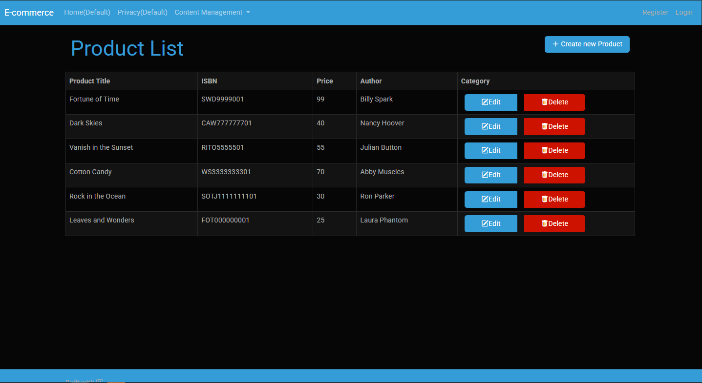
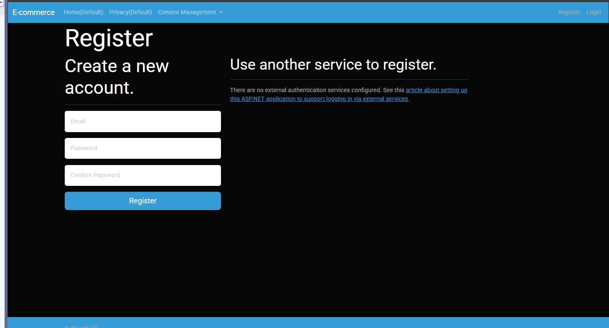

A modern, full-stack e-commerce platform built with **ASP.NET Core** demonstrating enterprise-level product management and secure user authentication. 

## Features

### Product Management
- **Comprehensive CRUD Operations**: Create, Read, Update, and Delete functionality for products and categories
- **Category Management**: Organize products into hierarchical categories

### Authentication & Security
- **Secure User Registration**: ASP.NET Identity implementation with email verification
- **Session Management**: Secure login/logout functionality
- **Password Security**: Hashed passwords with configurable complexity requirements


## Technologies

| Category | Technologies |
|----------|-------------|
| **Backend** | C#, ASP.NET Core 9.0, ASP.NET Identity |
| **Database** | Entity Framework Core, MS SQL Server |
| **Frontend** | Razor Pages, HTML5, CSS3, JavaScript, Bootstrap 5 |
| **Tools** | Visual Studio 2022, Package Manager Console, Git |


## Getting Started

### Prerequisites

Ensure you have the following installed:

- [.NET 9 SDK](https://dotnet.microsoft.com/download/dotnet/9.0) 
- [Visual Studio 2022](https://visualstudio.microsoft.com/) 
- [MS SQL Server](https://www.microsoft.com/en-us/sql-server/sql-server-downloads) 
- [Git](https://git-scm.com/)

1. **Clone the repository**
   ```bash
   git clone https://github.com/harinandana02/E-commerce-Platform.git
   cd E-commerce-Platform
   ```

2. **Configure the database connection**
   
   Update the connection string in `appsettings.json`:
   ```json
   {
     "ConnectionStrings": {
       "DefaultConnection": "Server=(localdb)\\mssqllocaldb;Database=ECommerceDB;Trusted_Connection=true;MultipleActiveResultSets=true"
     }
   }
   ```

3. **Install dependencies**
   ```bash
   dotnet restore
   ```

4. **Apply database migrations**
   ```bash
   dotnet ef database update
   ```
   
   *Or using Package Manager Console in Visual Studio:*
   ```powershell
   Update-Database
   ```

5. **Run the application**
   ```bash
   dotnet run
   ```


6. **Access the application**
   


   ## Screenshots

| Product Management | User Registration |
|-------------------|------------------|
|  |  |
